# Music Streaming Data Pipeline with AWS Glue and Airflow

## Overview

This project implements a real-time data pipeline for a music streaming service to process user streaming behavior. The pipeline ingests data from Amazon S3, performs validation and transformations using AWS Glue, computes key daily metrics (KPIs), and stores the results in Amazon DynamoDB for fast access by downstream applications. Orchestration is handled by Apache Airflow.

The pipeline handles streaming data arriving in batch files at irregular intervals in S3. It processes streams, songs, and user data, ensuring data quality through validations, transformations, and metric computations.

### Key Objectives
- Ingest streaming data from S3 at unpredictable intervals.
- Use Apache Airflow for orchestration and AWS Glue for ETL (Extract, Transform, Load) operations.
- Perform data validations and transformations using PySpark in Glue jobs.
- Compute daily genre-level KPIs, including:
  - Listen Count: Total plays of tracks in a genre per day.
  - Unique Listeners: Distinct users streaming a genre per day.
  - Total Listening Time: Cumulative listening time for a genre per day.
  - Average Listening Time per User: Mean listening duration per user per day.
  - Top 3 Songs per Genre per Day: Most played songs in each genre.
  - Top 5 Genres per Day: Most popular genres based on listen count.
- Store processed data in DynamoDB for real-time queries and business intelligence.

### User Stories
1. As a data engineer, ingest streaming data from S3 and process it via an automated pipeline.
2. As a data engineer, validate incoming datasets for required columns before processing.
3. As a data engineer, transform raw streaming data into metrics using AWS Glue.
4. As a data engineer, store processed data in DynamoDB for fast access.
5. As a business analyst, query DynamoDB for insights into user behavior and song performance.

## Architecture

- **Data Sources**: Raw CSV files in S3 (e.g., `s3://lab3-bucket/raw/streams/`, `s3://lab3-bucket/raw/songs/`, `s3://lab3-bucket/raw/users/`).
- **Orchestration**: Apache Airflow DAG to monitor S3, trigger Glue jobs, compute KPIs, and archive files.
- **ETL Processing**: AWS Glue jobs (PySpark) for transforming raw data to processed Parquet in S3 and loading into DynamoDB.
- **Storage**: Processed data in S3 (Parquet) and DynamoDB (table: `lab3`) with UUID keys.
- **Archival**: Processed files moved to `s3://lab3-bucket/archive/streams/`.

### Pipeline Flow
1. Airflow waits for new stream files in S3 using `S3KeySensor`.
2. Detects the latest file and triggers a Glue job to clean and transform it to Parquet.
3. Triggers another Glue job to compute KPIs and load data into DynamoDB.
4. Archives the processed file in S3.

## Components

### AWS Glue Jobs
- **rawtoprocessed-usrnsongs.py**: Transforms raw songs and users CSV from S3 to cleaned Parquet in `s3://lab3-bucket/processed/songs/` and `s3://lab3-bucket/processed/users/`.
  - Cleans strings (trim, lowercase), casts types, drops duplicates/NA, adds `record_type` ("song" or "user"), and computes account age for users.
- **processedtodynamo-usrnsongs.py**: Loads processed songs and users from S3, adds UUID keys (e.g., "song_trackid"), combines, and writes to DynamoDB table `lab3`.
  - Creates DynamoDB table if it doesn't exist (HASH key: `uuid`).
- **rawtoprocessed-streams.py**: Transforms raw streams CSV from S3 to cleaned Parquet in `s3://lab3-bucket/processed/streams/`.
  - Casts types, trims/lowercases, drops NA/duplicates, adds `record_type` ("stream") and UUID.
- **processedtodynamo-streams.py**: Loads cleaned streams from S3 Parquet and writes to DynamoDB table `lab3`.

**Note**: KPI computation (e.g., daily genre metrics) is referenced in the Airflow DAG as a Glue job named "dailykpis", but the script is not provided here. Assume it's a separate Glue job for aggregating metrics.

### Airflow DAG (test.py)
- DAG ID: `glue_stream_etl_pipeline`
- Schedule: Hourly (`@hourly`)
- Tasks:
  - `wait_for_stream_file`: Sensors for new CSV in `raw/streams/`.
  - `detect_latest_file`: Python operator to find the latest file key.
  - `run_clean_glue_job`: Runs Glue job "Transformation_job" to process the file.
  - `run_kpi_glue_job`: Runs Glue job "dailykpis" to compute and load KPIs to DynamoDB.
  - `archive_stream_data`: Python operator to move processed file to archive.
- Config: Uses `boto3` for S3 interactions; fallback to "streams1.csv" if no files.

## Setup Instructions

### Prerequisites
- AWS Account with access to S3, Glue, DynamoDB, and MWAA (Managed Workflows for Apache Airflow).
- S3 Bucket: `lab3-bucket` with folders: `raw/streams/`, `raw/songs/`, `raw/users/`, `processed/`, `archive/streams/`.
- Upload raw CSV files to `raw/` folders.
- AWS Glue Jobs: Upload the provided scripts to S3 and create Glue jobs with matching names (e.g., "Transformation_job" for raw-to-processed).
- Airflow Environment: Set up MWAA with AWS credentials (`aws_default` conn ID).
- Python Libraries: Airflow providers for AWS (e.g., `airflow.providers.amazon`).

### Steps to Deploy
1. **Create S3 Bucket and Upload Data**:
   - Create `lab3-bucket`.
   - Upload sample CSVs to `raw/songs/songs.csv`, `raw/users/users.csv`, and stream files to `raw/streams/`.

2. **Set Up AWS Glue Jobs**:
   - In AWS Glue Console, create jobs using the provided scripts (upload to S3 first).
   - Configure job details: Python version 3, Spark for PySpark jobs.
   - Add job parameters (e.g., `--JOB_NAME`).

3. **Set Up DynamoDB**:
   - Table: `lab3` in region `eu-north-1`.
   - Primary Key: `uuid` (String, HASH).

4. **Deploy Airflow DAG**:
   - Upload `test.py` to your MWAA DAGs folder in S3.
   - Trigger the DAG manually or wait for schedule.

## Running the Pipeline
- The DAG runs hourly, checking for new stream files.
- Monitor in Airflow UI (MWAA console).
- After processing, query DynamoDB for KPIs (e.g., using AWS Console or SDK).

## Logging & Error Handling
- Glue jobs include standard logging via CloudWatch.
- Airflow tasks have retries (2) and logging.
- Add custom error handling in Python functions (e.g., raise exceptions on no files).

## Troubleshooting
- Check CloudWatch Logs for Glue job errors.
- Verify S3 file permissions and paths.
- Ensure AWS credentials have IAM roles for S3/Glue/DynamoDB access.

